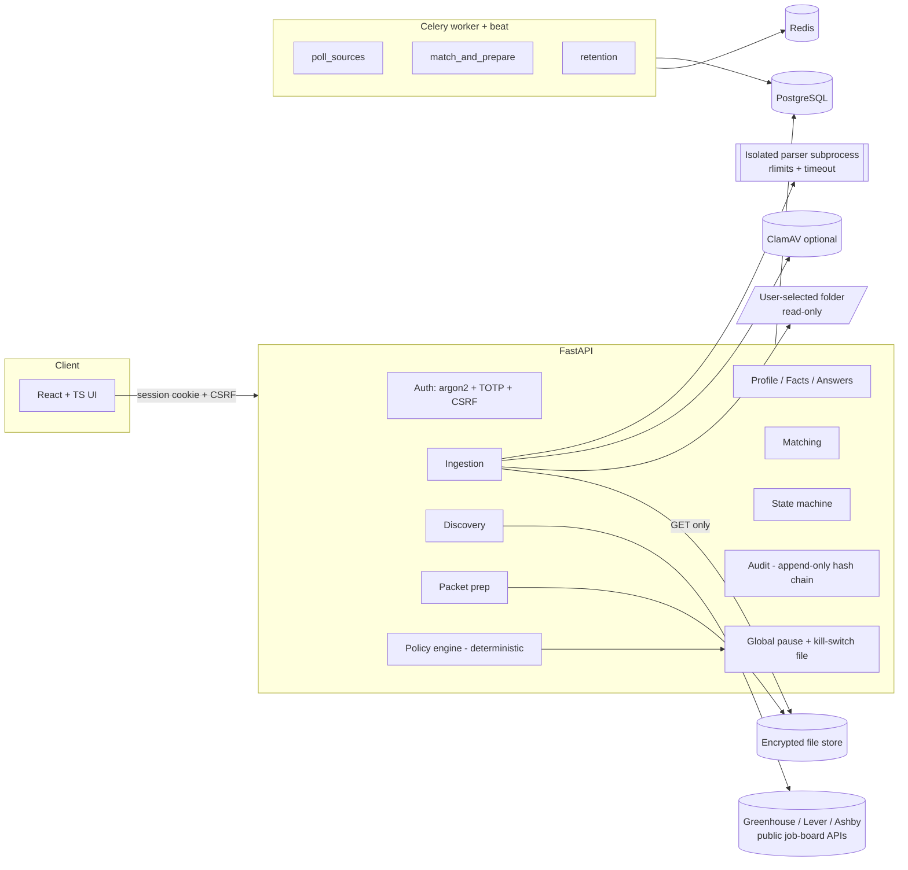
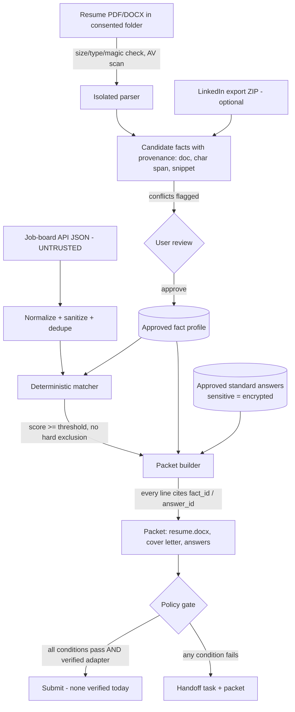
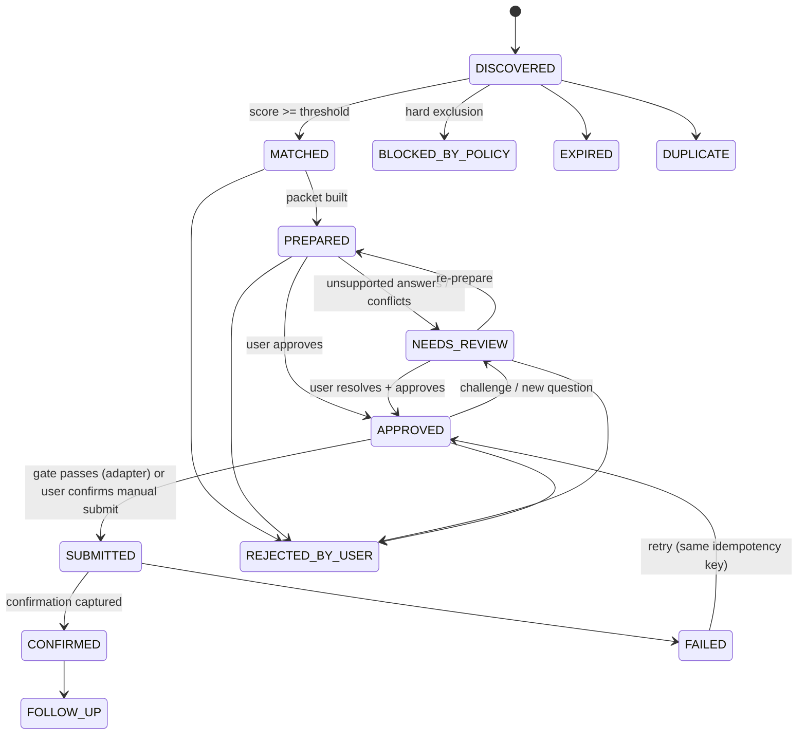

# Architecture — jobApplier MVP

Status: MVP, search-and-prepare mode. **Auto-submit is disabled by default, and no real submission integration is marked verified** (see "Submission reality" below).

## 1. Evaluation of the input documents

The two documents (build prompt + planning doc) are consistent and safety-first. Notes from evaluation:

| Topic | Finding | Decision |
|---|---|---|
| "100% automated" | Discovery, matching, packet prep and tracking can be fully automated. **Submission cannot be, with any source verified today** — see §6. | Build the full submission policy gate, idempotency, limits and kill switch, but route every application to a handoff packet until a submission route is verified. |
| Keycloak | Heavy for a single-user self-hosted MVP (JVM, realm config). | Built-in auth: argon2 password + TOTP MFA for admins, server-side sessions, CSRF, admin/viewer roles. Keycloak stays on the roadmap for multi-user deploys. |
| Apache Tika | Requires a JVM; pypdf + python-docx cover PDF/DOCX. | pypdf + python-docx, run in an isolated, resource-limited subprocess. Tika is optional/roadmap. |
| LLM use | Any LLM that reads job text is a prompt-injection surface. | **MVP is fully deterministic**: extraction, matching, tailoring and answer drafting use rules plus approved facts. With no model there is no injection path. A local model (Ollama is already running on this machine) is a roadmap item and must sit behind a claim-verifier. |
| Build prompt item numbering | The non-negotiables skip #4. | Nothing appears to be missing; all listed items are covered. |
| LinkedIn | No permitted scraping or login. | Accept the profile URL, plus an optional **user-downloaded LinkedIn data export ZIP** (Settings → "Get a copy of your data"), which is permitted. Conflicts with the resume become review items. |
| Cloud folders | Needs OAuth apps per provider. | MVP: local folder only, read-only, with an explicit consent record. Cloud providers are on the roadmap. |

## 2. Components

## 3. Data flow and trust boundaries

Trust rules:
- Job content is **data only**. It is never executed, templated as instructions or given to a model. It is used only for tokenized matching and for display, after sanitization (control characters stripped, HTML removed, length caps).
- The policy engine reads only DB state, config and the kill-switch file. Job text cannot reach it.
- Candidate claims in generated materials come **only** from approved facts (`fact_id`) or approved answers (`answer_id`). Job text contributes only the employer name and job title, both sanitized and length-capped.

## 4. Data model (summary; see `backend/app/models.py`)

| Table | Purpose |
|---|---|
| `users`, `sessions` | Auth (argon2 hash, TOTP secret encrypted, role); server-side sessions (token hash only). |
| `profiles` | Name, email/phone (encrypted), location, time zone, LinkedIn URL, portfolio links, resume folder + consent timestamp. |
| `documents` | Versioned resume files (sha256, encrypted blob path, parse status). Originals are never modified. |
| `facts` | Kind (role, achievement, education, skill, certification, project, contact), JSON data, provenance (document, char span, snippet, origin), status PENDING/APPROVED/REJECTED. |
| `fact_conflicts` | Resume vs LinkedIn (or resume vs profile) discrepancies. Open conflicts block approval of the involved facts. |
| `standard_answers` | question_key → answer, `sensitive` flag (encrypted), `approved` flag. |
| `preferences` | Titles, keywords, seniority, geographies, arrangements, employment types, salary floor, industries, exclusions, min score, cadence, daily limit, weights. |
| `sources` | Registry mirror (method, terms URL, date checked, rate limit, read/submit permission) + user toggles (`enabled`, `auto_submit_opt_in`). |
| `source_boards` | Employer boards to follow per source (board token / site name). |
| `connector_runs` | Health: status, counts, error, duration. |
| `jobs` | Normalized listing + `dedupe_key`, `content_hash`, `first_seen/last_seen`, `expired_at`, `duplicate_of_id`. |
| `applications` | One per (profile, job): state, match JSON, idempotency key. |
| `packets` | Generated materials + provenance map + answers; immutable once approved. |
| `submission_attempts` | Unique idempotency key, adapter, timestamps, confirmation, outcome. |
| `handoff_tasks` | Reason(s), packet link, apply URL, status. |
| `audit_events` | Append-only (DB trigger), SHA-256 hash chain, no sensitive values. |
| `system_controls` | `global_pause` and retention settings. |

## 5. State machine

The authoritative transition table is `backend/app/statemachine.py`. Any other transition raises an error and is audited.

## 6. Source-permission approach

- `config/sources.yaml` is the registry, one entry per source: method, base URL, terms/docs URL, `date_checked`, rate limit, fields, attribution, `read_permitted`, `submit_permitted`, notes.
- On startup the registry syncs into the `sources` table. **A source can only be enabled if `read_permitted: true`**, and auto-submit only if `submit_permitted: true` *and* a verified adapter exists.
- A connector refuses to run if its registry entry is missing, disabled, or its `date_checked` is older than `SOURCE_RECHECK_DAYS` (default 90), which forces a re-review.

### Submission reality (checked 2026-09-24)
| Source | Read (discovery) | Submit |
|---|---|---|
| Greenhouse Job Board API | Public GET, docs say no auth needed for GET endpoints | POST needs the **employer's** Job Board API key, so it is not available to candidates |
| Lever Postings API | Public GET; docs say published jobs "may be scraped by third parties" | POST needs a key created by the employer's Super Admin, so it is not available to candidates |
| Ashby Posting API | Public GET | No submit endpoint; candidates apply on Ashby's hosted page |

So in the MVP, **every submission is a handoff**: a prefilled packet plus the apply URL, and the user submits in their own browser. The adapter interface, policy gate, idempotency, limits and challenge handling are all implemented and tested against a test-only fake adapter. That machinery is ready when a route is verified.

## 7. Milestones

| # | Milestone | Status |
|---|---|---|
| M0 | Docs: architecture, source registry, threat model, state machine, API | this commit |
| M1 | Auth, profile, consented folder, isolated PDF/DOCX parsing, facts + provenance + review, LinkedIn export import, conflicts | this commit |
| M2 | Connectors (Greenhouse, Lever, Ashby), normalization, dedupe, expiry, backoff, health, scheduling, pause | this commit |
| M3 | Explainable matching, packet generation (DOCX resume, cover letter, answers), review queue | this commit |
| M4 | Policy gate, idempotency, limits, kill switch, handoff; no verified real adapter | this commit |
| M5 | Docker Compose, migrations, export/delete, retention, metrics, tests | this commit |
| M6 | Roadmap: see `ROADMAP.md` | future |
